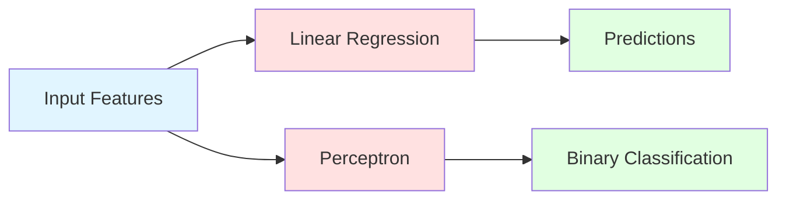

# 🧠 AI Foundations

## Overview

This section covers the fundamental building blocks of Machine Learning and AI. Understanding these concepts is essential before diving into modern AI techniques like LLMs, RAG, and Agents.

### Topics Covered

1. **Linear Regression** - The foundation of supervised learning
2. **Perceptron** - The simplest neural network unit

## 📊 Concept Diagram



## Linear Regression

Linear regression models the relationship between input features and continuous output values. It's the simplest form of supervised learning.

**Formula**: `y = mx + b`

Where:
- `y` is the predicted value
- `m` is the slope (weight)
- `x` is the input feature
- `b` is the intercept (bias)

**Use Cases**:
- Price prediction
- Sales forecasting
- Trend analysis

## Perceptron

The perceptron is the building block of neural networks. It takes multiple inputs, applies weights, adds bias, and passes through an activation function.

**Formula**: `output = activation(Σ(weights × inputs) + bias)`

**Use Cases**:
- Binary classification
- Building blocks for deep neural networks
- Pattern recognition

## 💻 Running the Examples

### Linear Regression Example
```bash
python 01_Foundations/linear_regression.py
```

This will:
- Generate sample data
- Train a linear regression model
- Visualize the results
- Show predictions

### Perceptron Example
```bash
python 01_Foundations/perceptron_example.py
```

This will:
- Create a simple binary classification problem
- Train a perceptron from scratch
- Display the decision boundary
- Test predictions

## 🎯 Key Takeaways

- **Linear Regression**: Simple, interpretable, great for continuous predictions
- **Perceptron**: Foundation of neural networks, handles binary classification
- Both are supervised learning methods that learn from labeled data
- These concepts scale up to modern deep learning architectures

## 🔗 Next Steps

After mastering these foundations:
1. Explore deep neural networks (multiple perceptrons stacked)
2. Learn about optimization algorithms (gradient descent)
3. Move on to modern AI: [02_LLMs](../02_LLMs/README.md)

## 📚 See Also

- [resources.md](./resources.md) - Curated learning materials
- [scikit-learn documentation](https://scikit-learn.org/)
