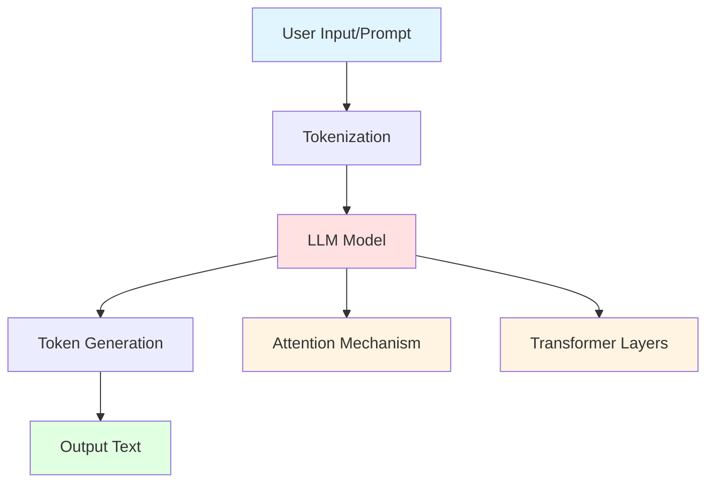

# 🤖 Large Language Models (LLMs)

## Overview

Large Language Models (LLMs) are AI systems trained on massive amounts of text data to understand and generate human-like text. They power applications like ChatGPT, GitHub Copilot, and many other AI assistants.

### Topics Covered

1. **LLM Basics** - Understanding how LLMs work
2. **OpenAI API** - Using GPT models programmatically
3. **Transformers** - The architecture behind modern LLMs

## 📊 Concept Diagram



## What are LLMs?

Large Language Models are neural networks with billions of parameters trained on diverse text data. They learn:
- **Language patterns** - Grammar, syntax, semantics
- **World knowledge** - Facts, relationships, concepts
- **Reasoning** - Logic, problem-solving patterns
- **Context understanding** - Following conversations

### Key Concepts

**Tokens**: Text is broken into tokens (words, subwords, or characters)
```
"Hello world" → ["Hello", " world"]
"AI-Essentials" → ["AI", "-", "Ess", "entials"]
```

**Prompts**: Instructions or context given to the model
```
System: "You are a helpful assistant"
User: "Explain photosynthesis"
```

**Temperature**: Controls randomness (0 = deterministic, 1+ = creative)

**Context Window**: Maximum tokens the model can process at once
- GPT-3.5: 4K-16K tokens
- GPT-4: 8K-128K tokens
- Claude: Up to 200K tokens

## 💻 Running the Examples

### Prerequisites
```bash
# Set your OpenAI API key
export OPENAI_API_KEY="your-api-key-here"
# or add to .env file
```

### OpenAI Example
```bash
python 02_LLMs/openai_example.py
```

Features:
- Simple chat completion
- Streaming responses
- Function calling
- Token counting

### Transformers Example
```bash
python 02_LLMs/transformers_example.py
```

Features:
- Using Hugging Face models
- Local model inference
- Text generation
- Model comparison

### Jupyter Notebook
```bash
jupyter notebook 02_LLMs/llm_basics.ipynb
```

Interactive exploration:
- LLM fundamentals
- Prompt engineering basics
- Comparing different models
- Visualizing attention patterns

## 🎯 Use Cases

### Text Generation
- Content creation
- Code generation
- Creative writing
- Email drafting

### Question Answering
- Customer support
- Knowledge retrieval
- Educational tutoring
- Research assistance

### Text Analysis
- Sentiment analysis
- Classification
- Summarization
- Translation

### Conversational AI
- Chatbots
- Virtual assistants
- Interactive agents
- Multi-turn dialogue

## 🔑 Best Practices

### Prompt Engineering
```python
# ❌ Vague prompt
"Tell me about AI"

# ✅ Clear, specific prompt
"Explain neural networks to a software engineer 
with 5 years experience but no ML background. 
Use code analogies."
```

### Error Handling
```python
try:
    response = client.chat.completions.create(...)
except OpenAIError as e:
    print(f"API Error: {e}")
```

### Cost Management
- Use GPT-3.5 for simple tasks
- Reserve GPT-4 for complex reasoning
- Monitor token usage
- Cache common responses

### Safety
- Validate user inputs
- Filter sensitive outputs
- Implement rate limiting
- Use content moderation

## 🧠 How LLMs Work (Simplified)

1. **Training Phase**
   - Model reads billions of text examples
   - Learns to predict next token
   - Develops understanding of language patterns

2. **Inference Phase**
   - Receives prompt + context
   - Generates tokens one at a time
   - Each token considers all previous tokens (attention)

3. **Fine-tuning**
   - Additional training on specific tasks
   - Instruction following
   - Alignment with human preferences (RLHF)

## 🚀 Popular LLM Providers

| Provider | Models | Context | Best For |
|----------|--------|---------|----------|
| OpenAI | GPT-3.5, GPT-4 | 4K-128K | General purpose, coding |
| Anthropic | Claude | 100K-200K | Long documents, safety |
| Google | PaLM, Gemini | 8K-32K | Multimodal, search |
| Meta | Llama 2 | 4K-32K | Open source, local |
| Mistral | Mistral, Mixtral | 8K-32K | Open source, efficient |

## 🔗 Next Steps

After understanding LLMs:
1. Learn [Prompt Engineering](../07_Prompt_Engineering/README.md) for better results
2. Explore [RAG](../03_RAG/README.md) for knowledge-grounded responses
3. Build [AI Agents](../05_Agents/README.md) that use LLMs with tools

## 📚 See Also

- [ai_in_5_minutes.md](./ai_in_5_minutes.md) - Quick LLM overview
- [Attention is All You Need](https://arxiv.org/abs/1706.03762) - Original Transformer paper
- [OpenAI API Documentation](https://platform.openai.com/docs)
- [Hugging Face Transformers](https://huggingface.co/docs/transformers)
