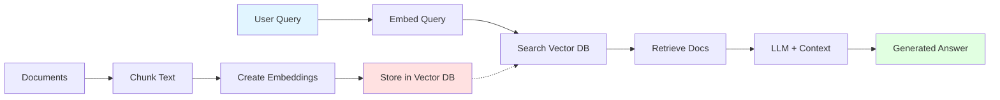

# 🔍 Retrieval-Augmented Generation (RAG)

## Overview

RAG combines the power of LLMs with external knowledge retrieval. Instead of relying solely on the model's training data, RAG retrieves relevant information from a knowledge base and uses it to generate more accurate, grounded responses.

### Topics Covered

1. **RAG Pipeline** - End-to-end RAG system
2. **Vector Stores** - Setting up document storage
3. **Embeddings** - Converting text to vectors

## 📊 Concept Diagram



## What is RAG?

**Problem**: LLMs have limitations:
- Knowledge cutoff dates
- Can't access private data
- May hallucinate facts

**Solution**: RAG provides LLMs with relevant, up-to-date context by:
1. Storing documents in a searchable vector database
2. Retrieving relevant chunks for each query
3. Injecting retrieved context into the LLM prompt

### RAG vs Fine-tuning

| Approach | Cost | Flexibility | Updates | Best For |
|----------|------|-------------|---------|----------|
| **RAG** | Low | High | Real-time | Knowledge retrieval |
| **Fine-tuning** | High | Low | Re-train | Behavior/style changes |

## The RAG Pipeline

### 1. Indexing Phase (Offline)
```
Documents → Chunking → Embeddings → Vector Store
```

### 2. Retrieval Phase (Online)
```
Query → Embed → Search → Top-K Results
```

### 3. Generation Phase
```
Query + Context → LLM → Answer
```

## 💻 Running the Examples

### RAG Pipeline Example
```bash
python 03_RAG/rag_pipeline.py
```

Features:
- Load sample documents
- Create embeddings
- Store in vector database
- Query with context retrieval
- Generate answers

### Vector Store Setup
```bash
python 03_RAG/vectorstore_setup.py
```

Features:
- Configure ChromaDB
- Bulk document ingestion
- Metadata filtering
- Similarity search

## 🎯 Use Cases

### Knowledge Management
- Internal documentation search
- FAQ automation
- Company wiki integration

### Customer Support
- Context-aware responses
- Product documentation lookup
- Troubleshooting guides

### Research & Analysis
- Scientific paper retrieval
- Legal document search
- Market research

### Content Creation
- Fact-checked writing
- Source-based articles
- Report generation

## 🔑 Key Components

### 1. Embeddings
Convert text to numerical vectors that capture semantic meaning:
```python
"dog" → [0.2, 0.8, 0.1, ...]
"puppy" → [0.3, 0.7, 0.15, ...]  # Similar vector
"car" → [-0.5, 0.1, 0.9, ...]    # Different vector
```

**Popular Models**:
- OpenAI `text-embedding-ada-002`
- Sentence Transformers
- Google Universal Sentence Encoder

### 2. Vector Database
Specialized database for similarity search:
```python
# Store
db.add(text="Python is great", metadata={"topic": "programming"})

# Search
results = db.similarity_search("coding in Python", k=3)
```

**Popular Options**:
- ChromaDB (local, easy)
- Pinecone (cloud, scalable)
- Weaviate (open source)
- FAISS (Facebook, fast)

### 3. Chunking Strategy
Break documents into manageable pieces:
- **Fixed size**: 500-1000 tokens
- **Semantic**: By paragraphs/sections
- **Recursive**: Split until size met
- **Overlap**: 50-100 tokens between chunks

### 4. Retrieval Methods
- **Similarity Search**: Cosine distance
- **Hybrid Search**: Vector + keyword
- **MMR**: Maximum Marginal Relevance (diversity)
- **Metadata Filtering**: Pre-filter by attributes

## 🚀 Building a Simple RAG System

```python
from langchain.vectorstores import Chroma
from langchain.embeddings import OpenAIEmbeddings
from langchain.chat_models import ChatOpenAI
from langchain.chains import RetrievalQA

# 1. Setup vector store
embeddings = OpenAIEmbeddings()
vectorstore = Chroma.from_texts(
    texts=["Python is a programming language...",
           "Machine learning uses data..."],
    embedding=embeddings
)

# 2. Create retrieval chain
llm = ChatOpenAI(model="gpt-3.5-turbo")
qa_chain = RetrievalQA.from_chain_type(
    llm=llm,
    retriever=vectorstore.as_retriever(k=3)
)

# 3. Query
answer = qa_chain.run("What is Python?")
```

## 📈 Optimizing RAG Performance

### Improve Retrieval
- Use better embeddings (domain-specific)
- Optimize chunk size and overlap
- Implement hybrid search
- Add metadata filters

### Improve Generation
- Craft better system prompts
- Include source citations
- Handle insufficient context
- Implement confidence scores

### Evaluation Metrics
- **Retrieval**: Precision@K, Recall@K, MRR
- **Generation**: Faithfulness, Answer relevance
- **End-to-End**: User satisfaction, accuracy

## 🎯 Best Practices

### ✅ Do
- Chunk documents appropriately
- Include metadata for filtering
- Cite sources in responses
- Monitor retrieval quality
- Version your embeddings

### ❌ Don't
- Use chunks that are too large/small
- Ignore document structure
- Trust retrieved context blindly
- Skip evaluation
- Forget about data freshness

## 🔗 Next Steps

After mastering RAG:
1. Explore [Vector Databases](../06_Vector_Databases/README.md) in depth
2. Build [AI Agents](../05_Agents/README.md) with RAG capabilities
3. Learn [Prompt Engineering](../07_Prompt_Engineering/README.md) for better queries

## 📚 See Also

- [ai_in_5_minutes.md](./ai_in_5_minutes.md) - Quick RAG overview
- [LangChain RAG Tutorial](https://python.langchain.com/docs/use_cases/question_answering/)
- [RAG Survey Paper](https://arxiv.org/abs/2312.10997)
