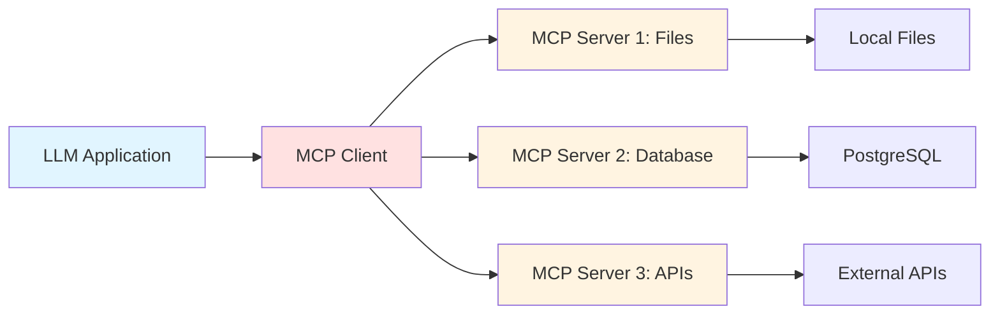

# 🔌 Model Context Protocol (MCP)

## Overview

The Model Context Protocol (MCP) is an open protocol that standardizes how AI applications interact with external data sources and tools. It enables seamless integration between LLMs and various data sources, APIs, and tools.

### Topics Covered

1. **MCP Basics** - Understanding the protocol
2. **Server Implementation** - Creating MCP servers
3. **Client Usage** - Connecting clients to servers

## 📊 Concept Diagram



## What is MCP?

**Problem**: Every AI application reinvents how to connect to data sources:
- Custom integrations for each tool
- No standardization
- Difficult to maintain
- Hard to share

**Solution**: MCP provides a standard protocol for:
- **Resources**: Accessing data (files, databases, APIs)
- **Prompts**: Reusable prompt templates
- **Tools**: Functions LLMs can call
- **Sampling**: LLM interaction patterns

### Key Benefits

✅ **Standardization** - One protocol for all integrations  
✅ **Composability** - Mix and match servers  
✅ **Security** - Controlled access to resources  
✅ **Reusability** - Share servers across applications  

## MCP Architecture

### Components

**1. MCP Host (Application)**
- Claude Desktop, IDEs, custom apps
- Manages lifecycle of servers
- Routes requests

**2. MCP Client**
- Built into the host
- Communicates via protocol
- Handles multiple servers

**3. MCP Server**
- Exposes resources, tools, prompts
- Can be language-agnostic
- Runs as separate process

### Communication

```
Host Application
    ↓ (manages)
MCP Client
    ↓ (JSON-RPC over stdio/HTTP)
MCP Server(s)
    ↓ (access)
Data Sources / APIs / Tools
```

## 💻 Running the Examples

### Prerequisites
```bash
# Python
pip install mcp

# Node.js
npm install @modelcontextprotocol/sdk
```

### Python MCP Server
```bash
python 04_MCP/mcp_server_example.py
```

Features:
- Basic server setup
- Resource exposure
- Tool implementation
- Request handling

### JavaScript MCP Client
```bash
node 04_MCP/client_example.js
```

Features:
- Server connection
- Resource listing
- Tool calling
- Error handling

## 🎯 Use Cases

### File System Access
```python
# MCP server exposes file operations
resources:
  - file://project/README.md
  - file://project/src/

tools:
  - read_file
  - write_file
  - search_files
```

### Database Integration
```python
# MCP server for database queries
resources:
  - db://customers
  - db://orders

tools:
  - query_database
  - get_schema
```

### API Wrapper
```python
# MCP server for external APIs
resources:
  - api://weather/current
  - api://news/latest

tools:
  - fetch_weather
  - search_news
```

### Development Tools
```python
# MCP server for dev workflows
tools:
  - run_tests
  - lint_code
  - deploy_app
```

## 🔑 Core Concepts

### Resources
Expose data that LLMs can read:
```json
{
  "uri": "file:///project/README.md",
  "name": "README",
  "mimeType": "text/markdown",
  "description": "Project documentation"
}
```

### Tools
Functions LLMs can call:
```json
{
  "name": "search_files",
  "description": "Search for files matching a pattern",
  "inputSchema": {
    "type": "object",
    "properties": {
      "pattern": {"type": "string"},
      "directory": {"type": "string"}
    }
  }
}
```

### Prompts
Reusable prompt templates:
```json
{
  "name": "code_review",
  "description": "Review code for issues",
  "arguments": [
    {"name": "file_path", "required": true}
  ]
}
```

## 🚀 Building an MCP Server

### Python Example
```python
from mcp.server import Server
from mcp.types import Resource, Tool

# Initialize server
server = Server("my-mcp-server")

# Register resource
@server.resource("file://config")
async def get_config():
    return {
        "uri": "file://config.json",
        "mimeType": "application/json",
        "text": '{"key": "value"}'
    }

# Register tool
@server.tool("calculate")
async def calculate(operation: str, a: float, b: float):
    if operation == "add":
        return a + b
    elif operation == "multiply":
        return a * b

# Run server
server.run()
```

### TypeScript Example
```typescript
import { Server } from "@modelcontextprotocol/sdk/server";
import { StdioServerTransport } from "@modelcontextprotocol/sdk/server/stdio";

const server = new Server({
  name: "my-mcp-server",
  version: "1.0.0"
});

// List resources
server.setRequestHandler("resources/list", async () => ({
  resources: [{
    uri: "file://data.json",
    name: "Data",
    mimeType: "application/json"
  }]
}));

// Start server
const transport = new StdioServerTransport();
await server.connect(transport);
```

## 🎯 Best Practices

### ✅ Do
- Use clear, descriptive names
- Provide detailed descriptions
- Validate inputs
- Handle errors gracefully
- Version your servers
- Document capabilities

### ❌ Don't
- Expose sensitive data without auth
- Create overly complex tools
- Ignore error handling
- Skip input validation
- Forget rate limiting

## 🔗 Integration Examples

### Claude Desktop
```json
// claude_desktop_config.json
{
  "mcpServers": {
    "filesystem": {
      "command": "python",
      "args": ["mcp_server_filesystem.py"]
    },
    "database": {
      "command": "node",
      "args": ["mcp_server_database.js"]
    }
  }
}
```

### Custom Application
```python
from mcp.client import ClientSession

async with ClientSession() as session:
    # Connect to server
    await session.connect("python mcp_server.py")
    
    # List resources
    resources = await session.list_resources()
    
    # Call tool
    result = await session.call_tool("search_files", {
        "pattern": "*.py"
    })
```

## 🌟 Real-World Servers

### Official Servers
- **Filesystem** - Read/write local files
- **GitHub** - Repository operations
- **Slack** - Channel interactions
- **PostgreSQL** - Database queries
- **Google Drive** - File access

### Community Servers
- API wrappers (OpenWeather, News)
- Development tools (Git, Docker)
- Productivity (Calendar, Email)
- Data sources (CSV, Excel)

## 📈 MCP Ecosystem

The MCP ecosystem is rapidly growing:
- 50+ official and community servers
- Support in Claude Desktop, IDEs
- Growing protocol adoption
- Active open-source community

## 🔗 Next Steps

After understanding MCP:
1. Build custom servers for your data
2. Integrate with [AI Agents](../05_Agents/README.md)
3. Combine with [RAG](../03_RAG/README.md) for enhanced capabilities

## 📚 See Also

- [ai_in_5_minutes.md](./ai_in_5_minutes.md) - Quick MCP overview
- [MCP Specification](https://spec.modelcontextprotocol.io/)
- [MCP GitHub](https://github.com/modelcontextprotocol)
- [Example Servers](https://github.com/modelcontextprotocol/servers)
