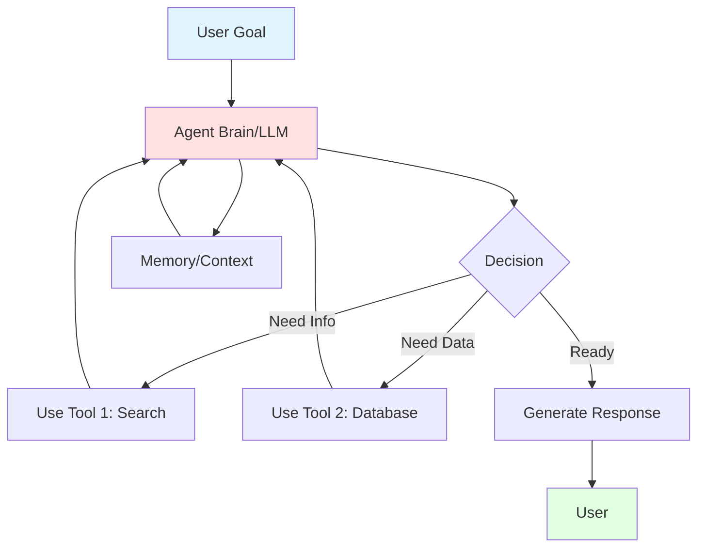

# 🤖 AI Agents

## Overview

AI Agents are autonomous systems that use LLMs to perceive their environment, make decisions, and take actions to achieve goals. Unlike simple chatbots, agents can use tools, plan multi-step tasks, and operate with minimal human intervention.

### Topics Covered

1. **Agent Architecture** - How agents work
2. **Tool Usage** - Giving agents capabilities
3. **Agent Frameworks** - OpenAI, CrewAI, LangChain

## 📊 Concept Diagram



## What are AI Agents?

**Simple Bot**: Follows fixed scripts
```
User: "What's the weather?"
Bot: "Let me check... It's sunny!"
```

**AI Agent**: Reasons and uses tools
```
User: "Should I bring an umbrella tomorrow?"
Agent: [Thinks: Need weather forecast]
      [Calls: weather_api(location, tomorrow)]
      [Reasons: 80% rain probability]
      [Responds: "Yes, there's an 80% chance of rain"]
```

### Key Characteristics

✅ **Autonomy** - Makes decisions independently  
✅ **Tool Use** - Can call APIs, query databases  
✅ **Planning** - Breaks down complex tasks  
✅ **Memory** - Maintains conversation context  
✅ **Adaptation** - Learns from outcomes  

## Agent Architecture

### Basic Loop

```
1. Perceive: Receive user input/goal
2. Think: Use LLM to reason about next action
3. Act: Execute tool or generate response
4. Observe: Process results
5. Repeat until goal achieved
```

### ReAct Pattern

```
Thought: "I need to find the user's account balance"
Action: query_database(user_id=123, table="accounts")
Observation: {"balance": 1500.00}
Thought: "Now I can answer the question"
Response: "Your current balance is $1,500.00"
```

## 💻 Running the Examples

### OpenAI Agent
```bash
python 05_Agents/openai_agent.py
```

Features:
- Function calling
- Multi-step reasoning
- Tool orchestration
- Error handling

### CrewAI Agent
```bash
python 05_Agents/crewai_agent_example.py
```

Features:
- Multi-agent collaboration
- Role-based agents
- Task delegation
- Structured workflows

## 🎯 Use Cases

### Customer Support
```
Agent capabilities:
- Query order status
- Check inventory
- Process refunds
- Escalate to human

Goal: Resolve 80% of inquiries autonomously
```

### Research Assistant
```
Agent capabilities:
- Search academic papers
- Extract key findings
- Summarize results
- Generate reports

Goal: Compile research on specific topics
```

### Development Helper
```
Agent capabilities:
- Read codebases
- Run tests
- Debug errors
- Generate fixes

Goal: Assist developers with coding tasks
```

### Data Analysis
```
Agent capabilities:
- Query databases
- Generate visualizations
- Statistical analysis
- Report generation

Goal: Answer business questions from data
```

## 🔑 Core Components

### 1. LLM Brain
The reasoning engine:
```python
llm = ChatOpenAI(model="gpt-4", temperature=0)
# Lower temperature for consistent reasoning
```

### 2. Tools
Functions the agent can call:
```python
tools = [
    {
        "name": "search_web",
        "description": "Search the internet for information",
        "parameters": {...}
    },
    {
        "name": "calculate",
        "description": "Perform mathematical calculations",
        "parameters": {...}
    }
]
```

### 3. Memory
Context storage:
```python
# Short-term: conversation history
memory = ConversationBufferMemory()

# Long-term: vector store for facts
knowledge_base = VectorStore()
```

### 4. Prompts
System instructions:
```python
system_prompt = """
You are a helpful assistant that can use tools.
When you need information, use the search_web tool.
When you need to calculate, use the calculate tool.
Always explain your reasoning.
"""
```

## 🚀 Building an Agent

### Simple OpenAI Agent
```python
from openai import OpenAI

client = OpenAI()

# Define tools
tools = [{
    "type": "function",
    "function": {
        "name": "get_weather",
        "description": "Get current weather",
        "parameters": {
            "type": "object",
            "properties": {
                "location": {"type": "string"}
            }
        }
    }
}]

# Agent loop
messages = [{"role": "user", "content": "What's the weather in Paris?"}]

while True:
    response = client.chat.completions.create(
        model="gpt-4",
        messages=messages,
        tools=tools
    )
    
    message = response.choices[0].message
    
    if message.tool_calls:
        # Execute tool
        for tool_call in message.tool_calls:
            result = execute_tool(tool_call)
            messages.append({
                "role": "tool",
                "content": result,
                "tool_call_id": tool_call.id
            })
    else:
        # Done
        print(message.content)
        break
```

### Multi-Agent with CrewAI
```python
from crewai import Agent, Task, Crew

# Define agents with roles
researcher = Agent(
    role="Researcher",
    goal="Find accurate information",
    tools=[search_tool]
)

writer = Agent(
    role="Writer",
    goal="Write engaging content",
    tools=[grammar_tool]
)

# Define tasks
research_task = Task(
    description="Research AI trends in 2024",
    agent=researcher
)

writing_task = Task(
    description="Write article based on research",
    agent=writer
)

# Create crew
crew = Crew(
    agents=[researcher, writer],
    tasks=[research_task, writing_task]
)

result = crew.kickoff()
```

## 🎯 Agent Patterns

### 1. ReAct (Reason + Act)
```
Input: "What's 25% of my account balance?"
Thought: Need to get account balance first
Action: get_balance(user_id)
Observation: $1000
Thought: Now calculate 25% of 1000
Action: calculate(1000 * 0.25)
Observation: $250
Response: "25% of your balance ($1000) is $250"
```

### 2. Plan and Execute
```
Goal: "Book a flight to Tokyo"
Plan:
  1. Search available flights
  2. Compare prices
  3. Check user preferences
  4. Make reservation
Execute: [Run each step]
```

### 3. Multi-Agent Collaboration
```
Task: "Write a research paper"
- Agent 1 (Researcher): Gather sources
- Agent 2 (Writer): Draft sections
- Agent 3 (Reviewer): Check quality
- Agent 4 (Editor): Final polish
```

## 📈 Best Practices

### ✅ Do
- Start simple, add complexity gradually
- Give agents clear instructions
- Limit tool access (principle of least privilege)
- Implement timeouts and safeguards
- Log all agent actions
- Test extensively before production

### ❌ Don't
- Give unlimited autonomy
- Skip error handling
- Ignore cost monitoring
- Allow irreversible actions without confirmation
- Forget about hallucination risks
- Neglect security

## 🔒 Safety Considerations

### Human in the Loop
```python
if action.is_critical():
    approval = request_human_approval(action)
    if not approval:
        return "Action cancelled by user"
```

### Action Validation
```python
def validate_action(action):
    if action.type == "delete":
        if not can_delete(action.target):
            raise SecurityError("Deletion not allowed")
```

### Rate Limiting
```python
@rate_limit(max_calls=10, window=60)
def agent_action():
    # Limit agent to 10 actions per minute
    pass
```

## 🌟 Popular Frameworks

| Framework | Best For | Language | Complexity |
|-----------|----------|----------|------------|
| **OpenAI Functions** | Simple agents | Python/JS | Low |
| **LangChain** | Complex workflows | Python/JS | Medium |
| **CrewAI** | Multi-agent systems | Python | Medium |
| **AutoGPT** | Autonomous agents | Python | High |
| **BabyAGI** | Task planning | Python | High |

## 🔗 Next Steps

After understanding agents:
1. Combine with [RAG](../03_RAG/README.md) for knowledge-grounded agents
2. Use [MCP](../04_MCP/README.md) for standardized tool access
3. Apply [Prompt Engineering](../07_Prompt_Engineering/README.md) for better behavior

## 📚 See Also

- [ai_in_5_minutes.md](./ai_in_5_minutes.md) - Quick agents overview
- [OpenAI Functions Guide](https://platform.openai.com/docs/guides/function-calling)
- [LangChain Agents](https://python.langchain.com/docs/modules/agents/)
- [CrewAI Documentation](https://docs.crewai.com/)
