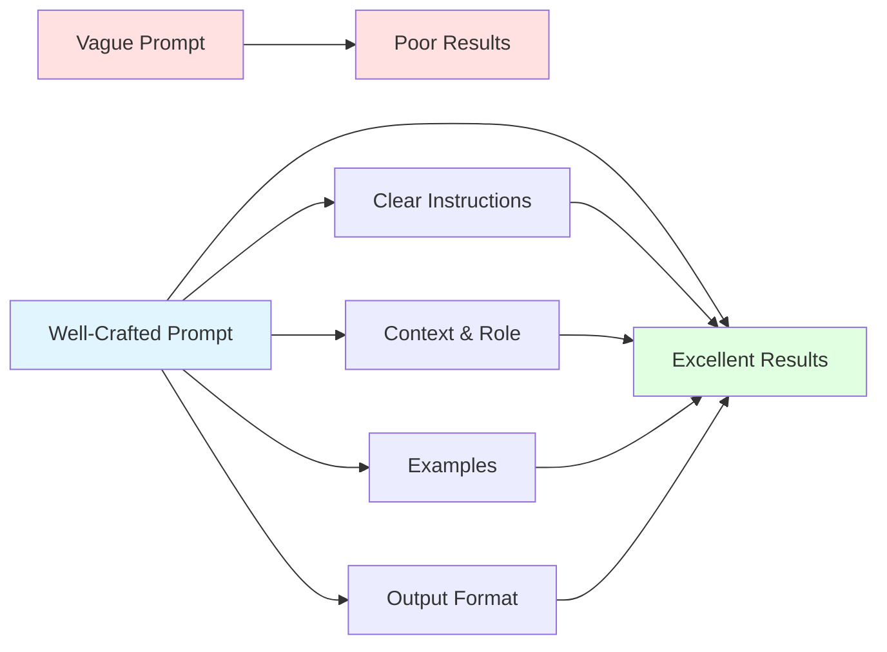

# 📝 Prompt Engineering

## Overview

Prompt Engineering is the art and science of crafting effective instructions for Large Language Models. Good prompts can dramatically improve AI output quality, accuracy, and usefulness.

### Topics Covered

1. **Prompt Basics** - Core principles
2. **Advanced Techniques** - Few-shot, chain-of-thought
3. **System Prompts** - Setting behavior and context

## 📊 Concept Diagram



## What is Prompt Engineering?

**Bad Prompt**:
```
"Tell me about AI"
```
→ Generic, unfocused response

**Good Prompt**:
```
"You are an AI expert teaching a software developer.
Explain neural networks using code analogies.
Keep it under 200 words. Include a simple example."
```
→ Specific, targeted, useful response

### Why It Matters

Same model, different prompts = dramatically different results:
- **Accuracy**: 40% → 90% with better prompts
- **Relevance**: Generic → Precisely what you need
- **Efficiency**: Fewer iterations to get desired output

## 💻 Running the Examples

### System Prompt Tuning
```bash
python 07_Prompt_Engineering/examples/system_prompt_tuning.py
```

Features:
- Different system prompt styles
- Role-based prompting
- Tone and format control
- Comparison of results

### Few-Shot Examples
See: `07_Prompt_Engineering/examples/few_shot_examples.md`

Learn:
- Zero-shot vs Few-shot
- Example selection
- Pattern recognition
- Task adaptation

## 🎯 Core Principles

### 1. Be Specific
```python
# ❌ Vague
"Write code"

# ✅ Specific
"Write a Python function that takes a list of integers
and returns the sum of even numbers. Include error
handling and docstrings."
```

### 2. Provide Context
```python
# ❌ No context
"Fix this bug"

# ✅ With context
"You are debugging a Python web application.
The error occurs in the authentication module when
users try to log in with OAuth. Here's the stack trace..."
```

### 3. Use Examples
```python
# ❌ No examples
"Extract key points"

# ✅ With examples
"Extract 3-5 key points from the text.
Example input: 'Python is great for AI...'
Example output:
• Python is popular for AI development
• It has extensive ML libraries
• Easy to learn syntax"
```

### 4. Specify Format
```python
# ❌ Unclear format
"Give me data"

# ✅ Clear format
"Return data in JSON format with these fields:
{
  'name': string,
  'age': integer,
  'skills': array of strings
}"
```

## 🚀 Advanced Techniques

### Chain-of-Thought (CoT)
Encourage step-by-step reasoning:
```python
prompt = """
Solve this problem step by step:
If John has 15 apples and gives 40% to Mary,
how many does he have left?

Let's think through this:
1. Calculate 40% of 15
2. Subtract from original amount
3. State the answer
"""
```

### Few-Shot Learning
Provide examples to guide behavior:
```python
prompt = """
Classify sentiment as positive, negative, or neutral.

Examples:
Text: "This product is amazing!"
Sentiment: positive

Text: "Terrible experience, would not recommend"
Sentiment: negative

Text: "The item arrived on time"
Sentiment: neutral

Now classify:
Text: "Best purchase I've made this year"
Sentiment:
"""
```

### Role Prompting
Assign an expert role:
```python
system_prompt = """
You are a senior software architect with 15 years
of experience in distributed systems. You provide
detailed, practical advice with real-world examples.
"""
```

### Constrained Generation
Set strict output rules:
```python
prompt = """
Answer in exactly 3 bullet points.
Each point must be under 20 words.
Use only technical terminology.
"""
```

## 📊 Prompt Patterns

### Pattern 1: Task-Context-Format
```
Task: Summarize this article
Context: For a technical audience, focusing on implementation details
Format: 5 bullet points, each with a code example
```

### Pattern 2: Role-Goal-Constraint
```
Role: You are a database expert
Goal: Optimize this SQL query for performance
Constraint: Explain each optimization and its impact
```

### Pattern 3: Examples-Then-Task
```
Example 1: Input → Output
Example 2: Input → Output
Example 3: Input → Output
Now do: New Input
```

### Pattern 4: Step-by-Step
```
Let's solve this systematically:
Step 1: [First step]
Step 2: [Second step]
Step 3: [Third step]
Final Answer: [Result]
```

## 🎨 Prompt Templates

### Code Review Template
```python
system = """
You are an expert code reviewer focusing on:
- Performance
- Security
- Best practices
- Code style
"""

user = """
Review this {language} code:
```{language}
{code}
```

Provide:
1. Overall assessment
2. Specific issues (with line numbers)
3. Suggested improvements
4. Security concerns
"""
```

### Data Analysis Template
```python
prompt = """
Analyze this data and provide:

1. Summary Statistics
   - Mean, median, mode
   - Standard deviation
   - Outliers

2. Key Insights
   - Trends
   - Patterns
   - Anomalies

3. Recommendations
   - Action items
   - Further analysis needed

Data:
{data}

Format output as JSON.
"""
```

### Creative Writing Template
```python
prompt = """
Write a {genre} story with:
- Setting: {setting}
- Characters: {characters}
- Tone: {tone}
- Length: {length} words
- Include: {must_include}
- Avoid: {must_avoid}

Begin with a hook that captures attention.
End with a surprising twist.
"""
```

## 🔧 System Prompt Best Practices

### Define Personality
```python
system = """
You are a friendly, patient teacher who:
- Explains concepts simply
- Uses analogies
- Encourages questions
- Provides examples
"""
```

### Set Boundaries
```python
system = """
You are a customer support agent.
You CAN:
- Answer product questions
- Process returns
- Provide troubleshooting

You CANNOT:
- Access user accounts
- Make pricing decisions
- Override company policy
"""
```

### Specify Output Style
```python
system = """
Format all responses as:
1. Direct answer (1-2 sentences)
2. Detailed explanation
3. Related resources
4. Next steps

Use markdown for formatting.
Keep tone professional but friendly.
"""
```

## 📈 Testing & Iteration

### A/B Testing Prompts
```python
# Version A
prompt_a = "Summarize this text"

# Version B
prompt_b = "Create a 3-sentence summary highlighting key facts"

# Test with same inputs, compare results
```

### Prompt Metrics
- **Accuracy**: Does it produce correct outputs?
- **Consistency**: Same prompt → similar results?
- **Efficiency**: Token usage vs quality trade-off
- **User Satisfaction**: Does it meet needs?

## 🎯 Common Pitfalls

### ❌ Avoid
```python
# Too vague
"Help me"

# Contradictory instructions
"Be brief but explain in detail"

# Assuming knowledge
"Fix the bug" (without context)

# No format specification
"Give me data" (structured how?)
```

### ✅ Do
```python
# Specific and clear
"Debug this Python function that should calculate
averages but returns wrong values"

# Consistent instructions
"Provide a 3-sentence summary"

# Provide context
"This is a web app using Flask. The bug occurs
when users submit forms..."

# Specify format
"Return results as JSON with 'status' and 'data' fields"
```

## 🔬 Advanced Topics

### Prompt Chaining
```python
# Step 1: Extract info
info = llm("Extract key facts from: {document}")

# Step 2: Analyze
analysis = llm("Analyze these facts: {info}")

# Step 3: Synthesize
report = llm("Create report from: {analysis}")
```

### Dynamic Prompts
```python
def build_prompt(task, difficulty, format):
    return f"""
    Task: {task}
    Difficulty: {difficulty}
    Output format: {format}
    
    Adjust explanation depth based on difficulty.
    """
```

### Retrieval-Augmented Prompts
```python
# Retrieve context from vector DB
context = vectordb.search(query)

# Include in prompt
prompt = f"""
Use this context to answer:
{context}

Question: {query}
"""
```

## 🔗 Next Steps

After mastering prompt engineering:
1. Apply to [LLMs](../02_LLMs/README.md) for better results
2. Enhance [RAG systems](../03_RAG/README.md) with better queries
3. Improve [AI Agents](../05_Agents/README.md) behavior

## 📚 See Also

- [ai_in_5_minutes.md](./ai_in_5_minutes.md) - Quick prompt engineering overview
- [OpenAI Prompt Engineering Guide](https://platform.openai.com/docs/guides/prompt-engineering)
- [Anthropic Prompt Library](https://docs.anthropic.com/claude/prompt-library)
- [Learn Prompting](https://learnprompting.org/)
